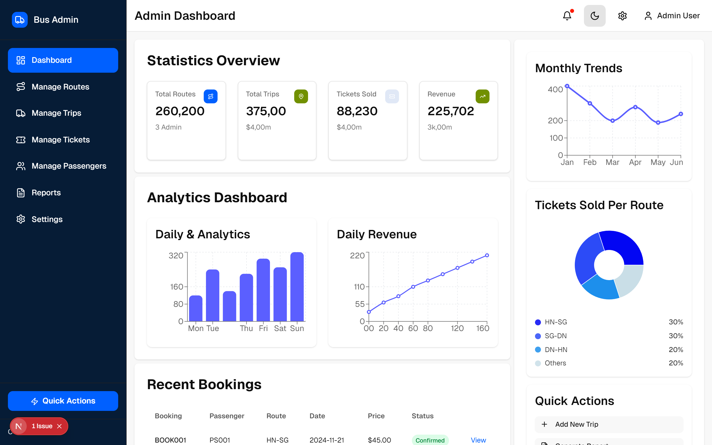
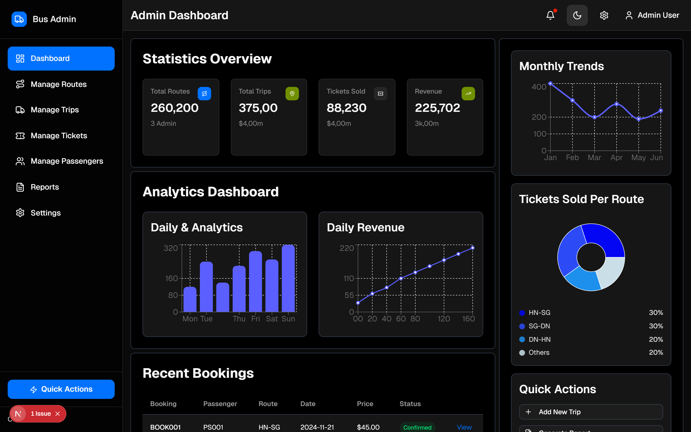
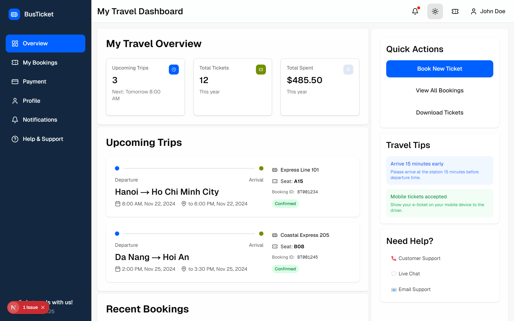
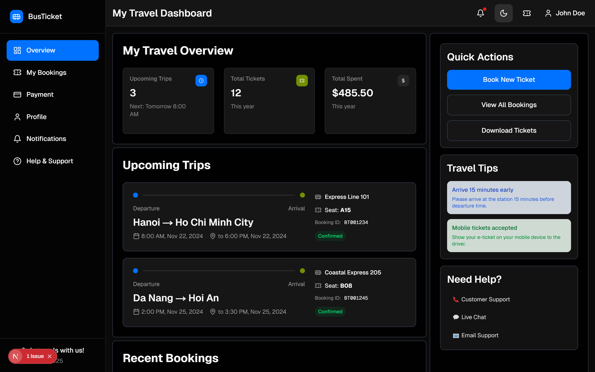
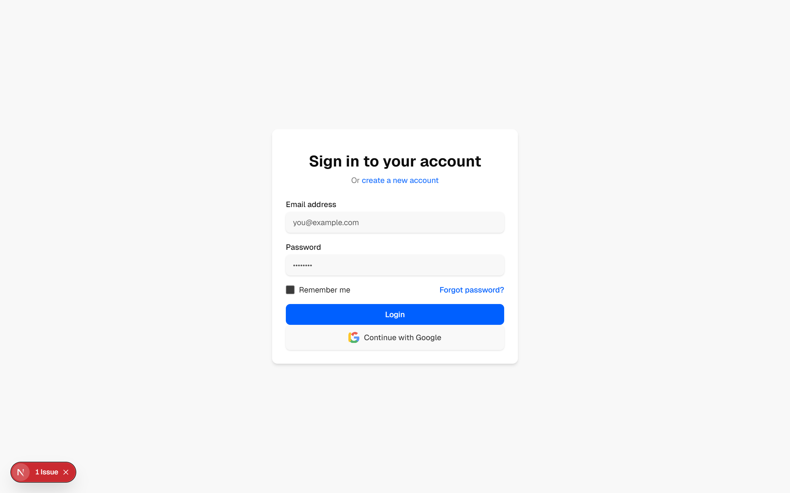
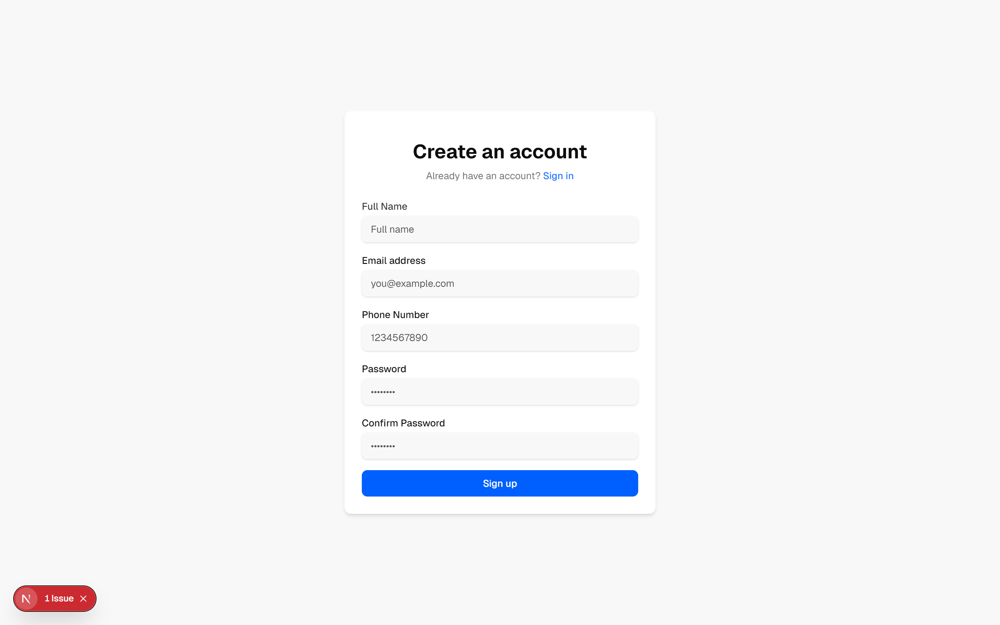

# Dashboard Screenshots

Generated on: 2025-11-24T00:03:04.634Z

## Available Screenshots

### Admin Dashboard - Light Mode
- **Light Mode**: 
- **WebP Format**: [admin-dashboard-light.webp](admin-dashboard-light.webp)
- **Path**: `/admin`
- **Theme**: `light`

### Admin Dashboard - Dark Mode
- **Light Mode**: 
- **WebP Format**: [admin-dashboard-dark.webp](admin-dashboard-dark.webp)
- **Path**: `/admin`
- **Theme**: `dark`

### User Dashboard - Light Mode
- **Light Mode**: 
- **WebP Format**: [user-dashboard-light.webp](user-dashboard-light.webp)
- **Path**: `/user`
- **Theme**: `light`

### User Dashboard - Dark Mode
- **Light Mode**: 
- **WebP Format**: [user-dashboard-dark.webp](user-dashboard-dark.webp)
- **Path**: `/user`
- **Theme**: `dark`

### Login Page
- **Light Mode**: 
- **WebP Format**: [login-page.webp](login-page.webp)
- **Path**: `/login`
- **Theme**: `light`

### Sign Up Page
- **Light Mode**: 
- **WebP Format**: [signup-page.webp](signup-page.webp)
- **Path**: `/signup`
- **Theme**: `light`


## Usage Instructions

1. **For Documentation**: Use PNG format for README files and documentation
2. **For Web**: Use WebP format for better compression in web applications
3. **For Design Reviews**: Use PNG format for sharing with stakeholders

## Updating Screenshots

To regenerate all screenshots:
```bash
npm run screenshot
```

To capture specific pages, modify the SCREENSHOT_TARGETS array in `scripts/take-screenshots.js`.

---

*Auto-generated by screenshot generator*
